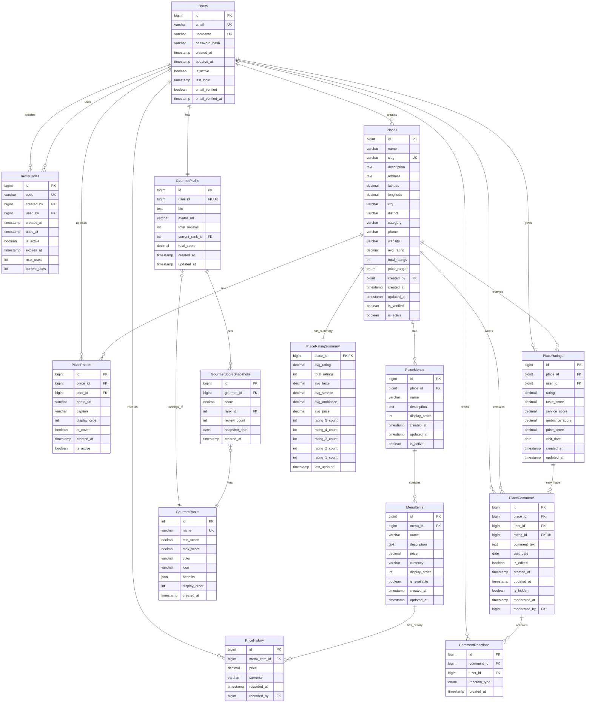

# Lezzet Atlası - Entity Relationship Diagram (ERD)

Bu dosya, Lezzet Atlası veritabanı yapısının görsel temsilini içerir.

## ERD - Mermaid Diyagramı

## İlişki Türleri ve Kardinalite

### 1. Users İlişkileri

| Tablo 1 | İlişki | Tablo 2 | Açıklama |
|---------|--------|---------|----------|
| Users | 1 : 1 | GourmetProfile | Her kullanıcının bir gurme profili var |
| Users | 1 : N | InviteCodes (creator) | Kullanıcı birden fazla davet kodu oluşturabilir |
| Users | N : 1 | InviteCodes (user) | Her davet kodu bir kullanıcı tarafından kullanılabilir |
| Users | 1 : N | Places | Kullanıcı birden fazla mekan ekleyebilir |
| Users | 1 : N | PlacePhotos | Kullanıcı birden fazla fotoğraf yükleyebilir |
| Users | 1 : N | PlaceRatings | Kullanıcı birden fazla değerlendirme yapabilir |
| Users | 1 : N | PlaceComments | Kullanıcı birden fazla yorum yazabilir |
| Users | 1 : N | CommentReactions | Kullanıcı birden fazla tepki verebilir |

### 2. Places İlişkileri

| Tablo 1 | İlişki | Tablo 2 | Açıklama |
|---------|--------|---------|----------|
| Places | 1 : N | PlacePhotos | Mekan birden fazla fotoğrafa sahip olabilir |
| Places | 1 : N | PlaceMenus | Mekan birden fazla menü kategorisine sahip olabilir |
| Places | 1 : N | PlaceRatings | Mekan birden fazla değerlendirme alabilir |
| Places | 1 : N | PlaceComments | Mekan birden fazla yorum alabilir |
| Places | 1 : 1 | PlaceRatingSummary | Mekanın bir özet istatistiği var |

### 3. Menü İlişkileri

| Tablo 1 | İlişki | Tablo 2 | Açıklama |
|---------|--------|---------|----------|
| PlaceMenus | 1 : N | MenuItems | Menü kategorisi birden fazla öğe içerir |
| MenuItems | 1 : N | PriceHistory | Her öğenin fiyat geçmişi takip edilir |

### 4. Rating/Comment İlişkileri

| Tablo 1 | İlişki | Tablo 2 | Açıklama |
|---------|--------|---------|----------|
| PlaceRatings | 1 : 0..1 | PlaceComments | Değerlendirmenin opsiyonel yorumu olabilir |
| PlaceComments | 1 : N | CommentReactions | Yorum birden fazla tepki alabilir |

### 5. Gurme Sistemi İlişkileri

| Tablo 1 | İlişki | Tablo 2 | Açıklama |
|---------|--------|---------|----------|
| GourmetProfile | N : 1 | GourmetRanks | Her profil bir rütbeye ait |
| GourmetProfile | 1 : N | GourmetScoreSnapshots | Profilin skor geçmişi takip edilir |
| GourmetScoreSnapshots | N : 1 | GourmetRanks | Her snapshot bir rütbe içerir |

## Önemli Kısıtlamalar (Constraints)

### Unique Constraints
- `Users.email` - Her e-posta benzersiz olmalı
- `Users.username` - Her kullanıcı adı benzersiz olmalı
- `GourmetProfile.user_id` - Her kullanıcının tek profili olabilir
- `InviteCodes.code` - Her davet kodu benzersiz olmalı
- `Places.slug` - Her mekan slug'ı benzersiz olmalı
- `PlaceRatings (user_id, place_id)` - Kullanıcı bir mekana sadece bir değerlendirme yapabilir
- `PlaceComments.rating_id` - Her değerlendirmenin tek yorumu olabilir
- `CommentReactions (user_id, comment_id, reaction_type)` - Kullanıcı bir yoruma aynı tepkiyi bir kez verebilir

### Check Constraints
- `PlaceRatings.rating` - 1.0 ile 5.0 arası olmalı
- `PlaceRatings.taste_score` - 1.0 ile 5.0 arası olmalı (opsiyonel)
- `PlaceRatings.service_score` - 1.0 ile 5.0 arası olmalı (opsiyonel)
- `PlaceRatings.ambiance_score` - 1.0 ile 5.0 arası olmalı (opsiyonel)
- `PlaceRatings.price_score` - 1.0 ile 5.0 arası olmalı (opsiyonel)

### Cascade Behaviors

#### ON DELETE CASCADE
- `Users → GourmetProfile` - Kullanıcı silinirse profil de silinir
- `Users → InviteCodes (creator)` - Kullanıcı silinirse oluşturduğu kodlar da silinir
- `Places → PlacePhotos` - Mekan silinirse fotoğraflar da silinir
- `Places → PlaceMenus` - Mekan silinirse menüler de silinir
- `PlaceMenus → MenuItems` - Menü silinirse öğeler de silinir
- `MenuItems → PriceHistory` - Öğe silinirse fiyat geçmişi de silinir
- `Places → PlaceRatings` - Mekan silinirse değerlendirmeler de silinir
- `PlaceRatings → PlaceComments` - Değerlendirme silinirse yorum da silinir
- `PlaceComments → CommentReactions` - Yorum silinirse tepkiler de silinir

#### ON DELETE RESTRICT
- `Users → Places (creator)` - Mekan ekleyen kullanıcı silinememez (mekanlar önce başka kullanıcıya devredilmeli)
- `Users → PlacePhotos` - Fotoğraf ekleyen kullanıcı silinememez

#### ON DELETE SET NULL
- `Users → InviteCodes (used_by)` - Kullanıcı silinirse davet kodunda NULL olur
- `Users → PriceHistory (recorded_by)` - Kullanıcı silinirse fiyat kaydında NULL olur
- `Users → PlaceComments (moderated_by)` - Moderatör silinirse yorum kaydında NULL olur

## Veri Bütünlüğü Kuralları

### İş Kuralları
1. **Tek Değerlendirme**: Bir kullanıcı bir mekana sadece bir kez değerlendirme yapabilir
2. **Opsiyonel Yorum**: Değerlendirme yapmak için yorum zorunlu değil
3. **Yorum için Değerlendirme**: Yorum yazmak için önce değerlendirme yapmak gerekli
4. **Davet Kodu Limiti**: Davet kodları kullanım limitine sahip (max_uses)
5. **Kapak Fotoğrafı**: Her mekanın en fazla bir kapak fotoğrafı olmalı (uygulama seviyesinde kontrol)
6. **Rütbe Aralığı**: Rütbeler skor aralıklarına göre otomatik atanır (trigger)
7. **Fiyat Geçmişi**: Fiyat değişiklikleri otomatik kaydedilir (trigger)

### Denormalizasyon Stratejisi
1. **Places.avg_rating ve total_ratings**: PlaceRatings'den hesaplanır ve cache'lenir
2. **PlaceRatingSummary**: Tüm değerlendirme istatistiklerini toplar (trigger ile güncellenir)
3. **GourmetProfile.total_score**: Dinamik hesaplanan skor (batch job veya trigger ile güncellenir)

## Görselleştirme Notları

Bu ERD diyagramı şunları göstermektedir:
- ✅ Tüm tablolar ve alanlar
- ✅ Primary Key (PK) ve Foreign Key (FK) ilişkileri
- ✅ Unique Key (UK) kısıtlamaları
- ✅ İlişki kardinaliteleri (1:1, 1:N, N:1)
- ✅ Veri tipleri

Diyagramı görselleştirmek için:
- GitHub'da otomatik render edilir
- [Mermaid Live Editor](https://mermaid.live/) kullanılabilir
- VS Code için Mermaid eklentisi yüklenebilir
